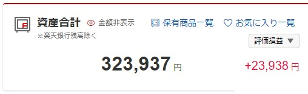
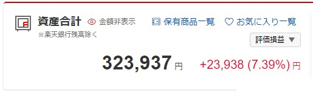

# Rakuten Securities ClearView

A Google Chrome extension for improve the UI of https://www.rakuten-sec.co.jp

## Features

Add percentage for total assets diff at the home page.

### AS IS

### TO BE

## How to install

1. Clone this repository to your local
2. Open `chrome://extensions/` in Google Chrome
3. Enable `Developer mode`
4. Click `Load unpacked` and select the cloned directory
5. Open <https://www.rakuten-sec.co.jp>, login, then you can see the improved UI
